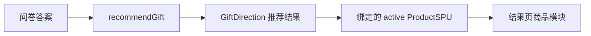

# 商品管理后端设计规划

> 目标：在不破坏现有 `GiftDirection` 推荐模型的前提下，新增一个真实商品供给层，让一个推荐方向可以挂多个商品 SPU，并为后续电商链接、价格、图片、上下架和点击转化打基础。

---

## 1. 背景与结论

当前项目的推荐核心单位是 `GiftDirection`，也就是「礼物方向 / 推荐品方向」。它负责回答：

- 这个礼物方向适合谁？
- 适合什么场景？
- 大概什么预算？
- 为什么值得推荐？
- 有什么风险和搭配建议？

它不应该直接承载真实商品链接、平台价格、库存、佣金、规格等运营信息。

因此商品管理后端应新增为「供给层」：

```text
RecommendationContext -> GiftDirection -> ProductSPU -> ProductOffer
```

第一期只做：

```text
GiftDirection 1 -> N ProductSPU
```

`ProductOffer` / SKU / 实时价格放到后续阶段。

---

## 2. 核心原则

1. `GiftDirection` 继续是推荐匹配单位。
   - 问卷匹配、排序、推荐理由仍然基于 `GiftDirection`。
   - 商品层不参与第一轮推荐打分，最多作为展示补充和商品可用性过滤。

2. `ProductSPU` 是商品管理单位。
   - 一个 SPU 表示一个可被用户理解的商品款式或服务项目。
   - 例如：`富士 instax mini 12`、`观夏昆仑煮雪香薰套装`、`始祖鸟 Mantis 2 腰包`。

3. 方向和商品通过关联表绑定。
   - 同一个商品可以挂到多个方向。
   - 同一个方向可以有多个商品，按运营权重排序。

4. 不把品牌、链接、价格塞进 `GiftDirection`。
   - `GiftDirection.searchKeywords` 仍可作为找商品的种子。
   - 真实商品信息进入 `ProductSPU` 和未来的 `ProductOffer`。

5. 后端第一期以运营稳定为先。
   - 先支持人工录入、审核、绑定、排序、上下架。
   - 不急着做自动抓价、库存同步、佣金比价。

---

## 3. 数据模型

### 3.1 `gift_directions`

沿用现有 `GiftDirection v3` 契约，不因商品层改字段。

关键字段：

```text
id
name
category
target
scene
budget
recipientStyle
toneFit
personaTags
gender
riskLevel
riskTags
tags
pairingTags
searchKeywords
recommendReason
```

说明：

- `searchKeywords` 可用于运营人员找候选商品。
- 推荐结果仍返回 direction 级别信息。
- 后续可以增加只读统计字段，如 `activeProductCount`，但不要写入 schema。

### 3.2 `product_spus`

真实商品的主数据。第一期不拆 SKU，价格只做区间或参考价。

建议字段：

```text
id                  string    商品 ID，kebab-case 或 spu_xxx
title               string    商品标题
brand               string    品牌，可为空
category            string    复用 GiftDirection category 枚举
summary             string    一句话商品说明
coverImage          string    商品主图 URL 或云存储 fileID
priceMin            number    参考最低价，单位分或元需统一
priceMax            number    参考最高价
currency            string    默认 CNY
purchaseType        string    ecommerce | o2o
platformHints       string[]  淘宝/京东/小红书/美团/大众点评等，仅提示
searchKeywords      string[]  商品搜索关键词
riskTags            string[]  商品层风险，如 看尺码、看色号、正品渠道
status              string    draft | active | inactive | archived
source              string    manual | imported | api
createdAt           string
updatedAt           string
```

价格单位建议第一期用「元」并在字段名里明确：

```text
priceMinYuan
priceMaxYuan
```

这样后台表单更直观，也避免小项目里过早引入分单位转换。

示例：

```json
{
  "id": "fujifilm-instax-mini-12",
  "title": "富士 instax mini 12 拍立得",
  "brand": "FUJIFILM",
  "category": "digital_accessories",
  "summary": "上手简单、出片有仪式感，适合生日和纪念日。",
  "coverImage": "",
  "priceMinYuan": 599,
  "priceMaxYuan": 899,
  "currency": "CNY",
  "purchaseType": "ecommerce",
  "platformHints": ["京东", "天猫"],
  "searchKeywords": ["富士 mini12", "拍立得礼物"],
  "riskTags": ["相纸另购"],
  "status": "active",
  "source": "manual",
  "createdAt": "2026-06-29T00:00:00.000Z",
  "updatedAt": "2026-06-29T00:00:00.000Z"
}
```

### 3.3 `direction_product_links`

方向和商品的多对多关系。

建议字段：

```text
id                  string    link_xxx
directionId         string
productId           string
rank                number    方向内排序，越小越靠前
fitReason           string    为什么这个商品适合这个方向
fitTags             string[]  精选、平价、质感、应急、送长辈等
status              string    active | hidden
createdAt           string
updatedAt           string
```

示例：

```json
{
  "id": "link-photo-camera-mini12",
  "directionId": "instant-camera",
  "productId": "fujifilm-instax-mini-12",
  "rank": 10,
  "fitReason": "操作简单，预算适中，送礼时更容易形成即时互动。",
  "fitTags": ["经典款", "好上手"],
  "status": "active",
  "createdAt": "2026-06-29T00:00:00.000Z",
  "updatedAt": "2026-06-29T00:00:00.000Z"
}
```

### 3.4 后续 `product_offers`

第二期或第三期再做，用来承载具体购买链接。

```text
id
productId
platform
title
url
imageUrl
priceYuan
couponInfo
commissionInfo
availability
lastCheckedAt
status
```

触发条件：

- 已经确定接入电商平台 API 或人工维护购买链接。
- 小程序详情页需要直接跳转购买。
- 需要对同一 SPU 展示多个平台报价。

---

## 4. 推荐与展示链路

### 4.1 第一阶段链路



推荐函数仍先产出 `GiftDirection` 列表。拿到 direction 后，再按 `direction_product_links` 查询绑定商品：

1. 过滤 `link.status = active`。
2. 过滤 `product.status = active`。
3. 按 `rank` 排序。
4. 每个 direction 最多返回 2-4 个商品。

### 4.2 返回结构建议

`recommendGift` 输出可以兼容增加 `products` 字段：

```json
{
  "candidates": [
    {
      "id": "instant-camera",
      "name": "拍立得相机",
      "tags": ["有互动", "仪式感"],
      "recommendReason": "能把当下变成可保存的纪念。",
      "products": [
        {
          "id": "fujifilm-instax-mini-12",
          "title": "富士 instax mini 12 拍立得",
          "brand": "FUJIFILM",
          "coverImage": "",
          "priceMinYuan": 599,
          "priceMaxYuan": 899,
          "fitReason": "操作简单，预算适中，适合送礼。"
        }
      ]
    }
  ]
}
```

如果某个方向没有 active 商品，不影响推荐结果展示，只是不显示商品模块。

---

## 5. 后台功能规划

### 5.1 商品列表

能力：

- 搜索商品标题、品牌、关键词。
- 按状态、品类、价格区间、购买类型筛选。
- 显示已绑定方向数量。
- 支持快速上架 / 下架 / 归档。

列表列建议：

```text
主图
标题
品牌
品类
价格区间
状态
绑定方向数
更新时间
操作
```

### 5.2 商品编辑

表单字段：

- 标题、品牌、品类。
- 一句话说明。
- 主图。
- 价格区间。
- 购买类型。
- 平台提示。
- 搜索关键词。
- 风险标签。
- 状态。

校验规则：

- `title` 必填。
- `category` 必须来自 `GiftDirection category` 枚举。
- `priceMinYuan <= priceMaxYuan`。
- `status` 只能是 `draft | active | inactive | archived`。
- active 商品必须至少有标题、品类、价格区间或明确的无价格说明。

### 5.3 方向绑定商品

在 `GiftDirection` 编辑页新增「关联商品」区：

- 搜索并添加 SPU。
- 调整排序。
- 编辑 `fitReason`。
- 标记精选 / 平价 / 高质感 / 应急等 `fitTags`。
- 隐藏某个绑定关系但不删除商品。

也可以在商品编辑页反向展示：

- 这个商品已绑定到哪些方向。
- 支持解除绑定。

### 5.4 导入与辅助匹配

第一期可做轻量辅助：

1. 从 `GiftDirection.searchKeywords` 生成候选搜索词。
2. 运营人工录入 SPU。
3. 后台根据 `category` 和关键词提示可能可绑定的方向。

不建议第一期做自动抓取和自动绑定，因为错误成本高，且商品质量会直接影响用户信任。

---

## 6. 存储与技术路线

### 6.1 本地后台延续方案

如果继续沿用当前 `admin/` 的离线工具，建议新增：

```text
admin/data/products.json
admin/data/direction-products.json
admin/server/productStore.js
admin/server/productSchema.js
admin/server/productImport.js
admin/web 商品管理页
```

优点：

- 继续断网可用。
- Git diff 清晰。
- 不引入线上鉴权和部署复杂度。
- 适合第一批人工整理商品池。

缺点：

- 小程序不能实时读取，仍需要导出或同步。
- 不适合多人同时运营。

### 6.2 CloudBase 在线方案

如果要让商品池线上实时生效，建议 CloudBase 文档数据库集合：

```text
gift_directions
product_spus
direction_product_links
product_offers    // 后续
```

推荐函数 `recommendGift` 仍是 Event Function，通过服务端权限读取商品集合。

权限原则：

- 小程序端不要直接写商品集合。
- 商品管理写操作只走管理员后台或受控云函数。
- 普通用户只通过 `recommendGift` 读取筛选后的商品摘要。
- 购买链接、佣金信息等敏感字段不要直接全量暴露给客户端。

### 6.3 建议路线

第一期先做本地后台扩展，稳定模型和运营流程：

```text
本地 products.json -> 导出 product runtime -> recommendGift 合并返回
```

第二期再同步到 CloudBase：

```text
admin 导出/同步 -> CloudBase collections -> recommendGift 实时读取
```

---

## 7. API 设计草案

如果在现有 `admin/server` 扩展，建议本地 API：

```text
GET    /api/products
POST   /api/products
GET    /api/products/:id
PUT    /api/products/:id
DELETE /api/products/:id

GET    /api/directions/:id/products
POST   /api/directions/:id/products
PUT    /api/directions/:id/products/:productId
DELETE /api/directions/:id/products/:productId

POST   /api/products/export
```

导出产物建议：

```text
admin/dist/client/productCatalog.js
admin/dist/server/productCatalog.js
```

运行时结构：

```js
const PRODUCT_SPUS = [];
const DIRECTION_PRODUCT_LINKS = [];

module.exports = {
  PRODUCT_SPUS,
  DIRECTION_PRODUCT_LINKS,
};
```

---

## 8. 分阶段实施计划

### Phase 1：商品池本地管理

目标：能维护商品 SPU，并和方向建立绑定。

任务：

- 新增 `product_spus` schema。
- 新增 `direction_product_links` schema。
- 新增本地 JSON store。
- 新增商品 CRUD API。
- 新增方向绑定商品 API。
- 新增后台商品列表和编辑页。
- 新增测试覆盖 CRUD、校验、绑定、排序。

验收：

- 能创建商品。
- 能把多个商品绑定到同一个 GiftDirection。
- 能调整商品排序。
- 下架商品不会出现在导出结果里。

### Phase 2：推荐结果合并商品

目标：推荐结果页可以展示每个方向下的精选商品。

任务：

- 新增商品 catalog 导出。
- `recommendGift` 加载商品 catalog。
- 给 candidate 合并 `products`。
- 小程序结果卡片增加商品模块。
- 无商品时保持原展示不变。

验收：

- 推荐结果仍可在无商品数据时正常返回。
- 有绑定商品时，每个方向展示排序后的 active 商品。
- 单测覆盖商品过滤、排序、无商品降级。

### Phase 3：CloudBase 同步

目标：商品池可在线更新，减少发版成本。

任务：

- 创建 `product_spus` 和 `direction_product_links` 集合。
- 写同步脚本或管理云函数。
- `recommendGift` 支持从数据库读取商品。
- 增加缓存或静态兜底，避免数据库异常导致推荐不可用。

验收：

- 数据库有商品时优先读取线上商品。
- 数据库失败时回退本地 catalog。
- 商品写入只允许管理员流程。

### Phase 4：Offer / 链接 / 价格

目标：从商品推荐进入购买决策。

任务：

- 新增 `product_offers`。
- 支持平台、链接、价格、券、可用状态。
- 增加链接健康检查。
- 小程序端展示购买入口。

验收：

- 同一 SPU 可挂多个购买链接。
- 下架或失效链接不展示。
- 点击行为可进入反馈或统计链路。

---

## 9. 测试策略

### 后端单测

- ProductSPU schema 校验。
- DirectionProductLink schema 校验。
- 商品 CRUD。
- 绑定关系增删改。
- 同一 direction 下 rank 排序。
- inactive / archived 商品不导出。
- hidden link 不导出。

### 推荐单测

- direction 无商品时，candidate 正常返回。
- direction 有多个商品时，只返回 active 且按 rank 排序。
- 商品字段只返回客户端需要的摘要，不泄漏管理字段。

### 回归测试

- `npm test`。
- `node scripts/check-recommender.js`。
- 管理后台导出后，确认现有 `giftDirections.js` 不被商品导出流程意外覆盖。

---

## 10. 非目标

第一期不做：

- 自动爬取商品。
- 实时比价。
- SKU 规格矩阵。
- 库存同步。
- 佣金结算。
- 多用户权限后台。
- 商品参与推荐主排序。
- 把商品字段写回 `GiftDirection` schema。

---

## 11. 关键风险

1. 商品层污染推荐层。
   - 规避：`GiftDirection` 不存商品详情，只存搜索种子。

2. 商品维护成本过高。
   - 规避：先维护少量精选 SPU，每个方向 2-4 个即可。

3. 链接和价格很快失效。
   - 规避：第一期不承诺实时价格，只展示参考价或价格区间。

4. 推荐结果变成货架。
   - 规避：先推荐方向，再展示商品；商品模块作为「可买参考」，不要替代推荐解释。

5. 数据源切换影响稳定性。
   - 规避：本地 catalog 兜底，CloudBase 读取失败不阻断推荐。

---

## 12. 推荐的下一步

建议先执行 Phase 1，在当前离线 `admin/` 后台里增加商品池和绑定关系。

最小可交付范围：

```text
1. product_spus 本地 JSON 存储
2. direction_product_links 本地 JSON 存储
3. 商品 CRUD
4. 在方向详情里绑定商品
5. 导出 productCatalog.js
6. 单测覆盖核心校验和导出
```

这一步做完后，再决定是否把商品数据接入 `recommendGift` 和小程序结果页。
