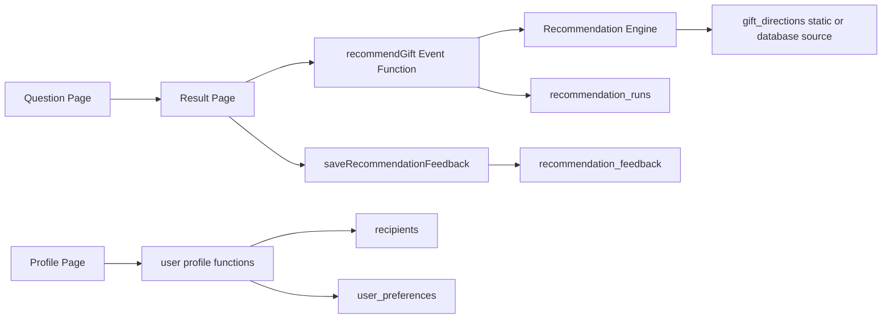

# Gift Backend Design

## Architecture

The backend stays on CloudBase Event Functions. Mini Program pages call functions through `wx.cloud.callFunction()`. Functions use `cloud.getWXContext().OPENID` for ownership and write privileged records to CloudBase document database.



## Recommendation Runtime

`recommendGift` should be the stable entry point. It should:

- Normalize answers into the current questionnaire vocabulary.
- Expand legacy gift fields into current-match fields at runtime.
- Hard-filter on strong constraints when possible.
- Score on target, scene, budget, recipient style, delivery/preparation, emotion, and visual style.
- Return a fallback ranking if strict filtering yields no results.
- Add metadata for traceability.

For the first implementation, gift directions can still be loaded from JS files. The engine should be written so `loadGiftDirections()` can later read from `gift_directions` without changing the result page contract.

## Data Collections

### `gift_directions`

Stores reviewed gift directions.

Key fields:

- `giftId`
- `name`
- `target`
- `gender`
- `scene`
- `occupation`
- `recipientStyle`
- `budget`
- `preparationTime`
- `emotionalTags`
- `visualStyle`
- `highlights`
- `riskTags`
- `pairingTags`
- `recommendReason`
- `status`
- `schemaVersion`
- `createdAt`
- `updatedAt`

### `recommendation_runs`

Stores generated recommendation snapshots.

Key fields:

- `_openid`
- `runId`
- `answers`
- `normalizedAnswers`
- `candidateIds`
- `summary`
- `pairings`
- `modelVersion`
- `questionnaireVersion`
- `schemaVersion`
- `createdAt`

### `recommendation_feedback`

Stores lightweight behavior signals.

Key fields:

- `_openid`
- `runId`
- `giftId`
- `action`
- `context`
- `createdAt`

Allowed actions: `refresh`, `view_more`, `click_gift`, `favorite`, `dislike`.

### `recipients`

Stores user-managed recipient profiles.

Key fields:

- `_openid`
- `recipientId`
- `nickname`
- `target`
- `gender`
- `occupation`
- `recipientStyle`
- `notes`
- `createdAt`
- `updatedAt`

### `user_preferences`

Stores user-level defaults.

Key fields:

- `_openid`
- `defaultBudget`
- `preferredStyles`
- `avoidTags`
- `createdAt`
- `updatedAt`

## Function Contracts

### `recommendGift`

Input:

```json
{
  "answers": {
    "target": "partner",
    "gender": "female",
    "scene": "birthday",
    "occupation": "creative",
    "recipientStyle": "aesthetic",
    "budget": "200_500"
  }
}
```

Output:

```json
{
  "summary": "给恋人的这次礼物，更适合选有仪式感但不夸张、送达节奏也比较稳的方向。",
  "boundaryNote": "",
  "candidates": [],
  "pairings": [],
  "meta": {
    "runId": "rec_xxx",
    "schemaVersion": "gift-backend-v1",
    "questionnaireVersion": "2026-05-30-candidate-v2",
    "modelVersion": "decision-table-v1",
    "userScoped": true
  }
}
```

### `saveRecommendationFeedback`

Input:

```json
{
  "runId": "rec_xxx",
  "giftId": "photo-book",
  "action": "favorite",
  "context": {}
}
```

Output:

```json
{ "ok": true }
```

### `listRecommendationHistory`

Input:

```json
{ "limit": 20, "offset": 0 }
```

Output:

```json
{ "items": [], "hasMore": false }
```

### `manageRecipientProfile`

Input:

```json
{ "action": "list" }
```

Actions: `list`, `create`, `update`, `delete`.

## Permissions

- Mini Program users do not provide user IDs.
- Cloud functions derive identity from `OPENID`.
- User-owned collections should be readable/writable only by the owner.
- Gift data writes should stay behind admin operations or privileged functions.

## Testing Strategy

- Unit-test answer normalization and scoring with current questionnaire values.
- Unit-test legacy budget compatibility.
- Unit-test fallback ranking when strict matching returns no candidates.
- Use WeChat Developer Tools for end-to-end cloud function calls after deployment.
